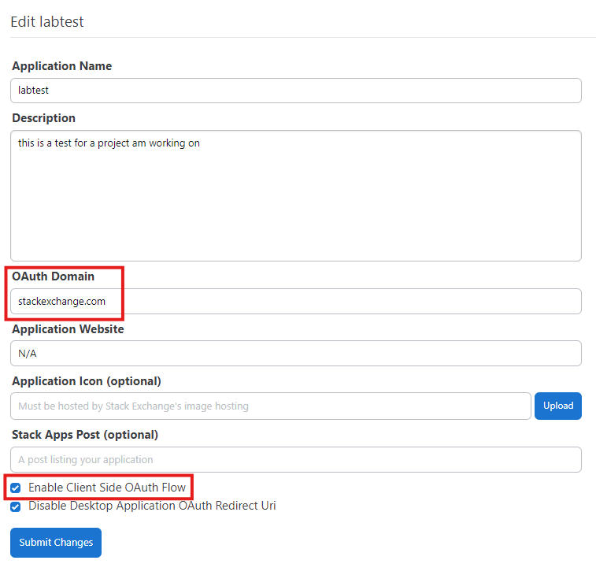

# SOF Lab

## Description

This Java program allows users to fetch SOF users using name from the API ,
view the results, navigate through pages, bookmark users, 
and manage these bookmarks. The program is designed with a simple 
command-line interface that enables easy interaction and efficient 
search operations.

## Features

Search for Users: Users can search for specific names in the dataset. The search returns up to 100 results per page, and users can navigate through these pages.
Pagination: Users can move forward and backward through search result pages.
Bookmarking: Users can bookmark specific results and view their bookmarked users at any time.
De-Bookmarking: Users can remove users from their list of bookmarks.
Saving Results: Users can save search results to a file.

## Getting the key
* on stack https://stackapps.com/ create an app and edit those two app settings
OAuth Domain = stackexchange.com and enable "Enable Client Side OAuth Flow"

* using this request URL https://stackoverflow.com/oauth/dialog?client_id="yourClientId"&scope=no_expiry&redirect_uri=https://stackexchange.com
change the client id to your client id from the app u will get a key in the URL to use in the .env as auth=*the key here
## Running the project

The project could be easily run when using intelliJ IDEA by cloning
the project from github and then importing it using intelliJ IDEA:
new -> import from existing source -> select the folder cloned into and run "main".
If you have any questions don't hesitate to contact me

* regarding the *userAge* the API is not returning it 
* *used a file to store the bookmarked users for ease of use since we're using the .sofusers file.
*  **https://github.com/cdimascio/dotenv-java using this for .env file to store the key for the API.
* ***https://github.com/google/gson using this to deal with the fetched data.
* ****the .env file should contain auth=*key* 
* in the code you will find asterisk here will be the explanation.

